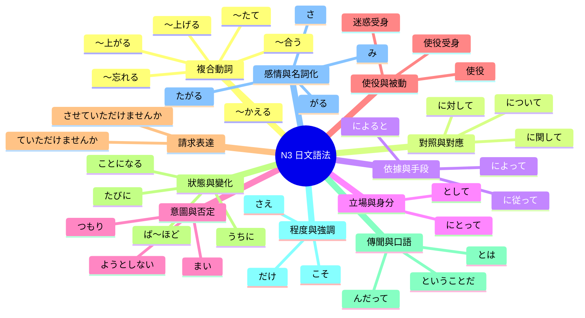

# N3 日文語法彙整

這是 N3 文法的總覽，點擊連結可以跳到各個分類。

## 主要分類

- [[#複合動詞（〜合う／〜上げる／〜忘れる／〜たて）]]
- [[#對照與對應（に対して／に関して）]]
- [[#依據、手段與原因（によって／に従って）]]
- [[#立場與身分（として／にとって）]]
- [[#意圖與否定意志（つもり／まい）]]
- [[#使役與被動（使役／受身）]]
- [[#請求與禮貌表達（ていただけませんか）]]
- [[#狀態、變化與習慣（うちに／ほど／ことに）]]
- [[#傳聞、解釋與口語縮約（って／んだって）]]
- [[#程度與強調（こそ／さえ／だけ）]]
- [[#感情表現與名詞化（がる／たがる／さ／み）]]

---

## 複合動詞（〜合う／〜上げる／〜忘れる／〜たて）

動詞連用形後接特定動詞，形成新的複合意義。

### 互相動作（〜合う）
| 文法 | 用法 | 連結 |
|:---|:---|:---|
| 〜合う | 互相做某動作 | [[〜合う]] |
| 話し合う | 互相討論 | [[〜合う#常見搭配]] |
| 助け合う | 互相幫助 | [[〜合う#常見搭配]] |
| 愛し合う | 互相相愛 | [[〜合う#常見搭配]] |

### 完成（〜上がる／〜上げる）
| 文法 | 用法 | 連結 |
|:---|:---|:---|
| 〜上がる | 自然完成（自動詞，用「が」） | [[〜上がる]] |
| 〜上げる | 主動完成（他動詞，用「を」） | [[〜上げる]] |
| 焼き上がる | 烤好了 | [[〜上がる#常見搭配]] |
| 書き上げる | 寫完 | [[〜上げる#常見搭配]] |

### 重新／換（〜かえる）
| 文法 | 用法 | 連結 |
|:---|:---|:---|
| 〜かえる | 重新做、換〜 | [[〜かえる]] |
| 乗りかえる | 換乘 | [[〜かえる#常見搭配]] |
| 書きかえる | 改寫、重寫 | [[〜かえる#常見搭配]] |

### 忘記（〜忘れる）
| 文法 | 用法 | 連結 |
|:---|:---|:---|
| 〜忘れる | 忘記做某動作 | [[〜忘れる]] |
| 飲み忘れる | 忘記吃（藥） | [[〜忘れる#常見搭配]] |
| 消し忘れる | 忘記關 | [[〜忘れる#常見搭配]] |

### 剛完成（〜たて）
| 文法 | 用法 | 連結 |
|:---|:---|:---|
| 〜たて | 剛〜的（新鮮狀態） | [[〜たて]] |
| 焼きたて | 剛烤好的 | [[〜たて#常見搭配]] |
| 卒業したて | 剛畢業的 | [[〜たて#常見搭配]] |

---

## 對照與對應（に対して／に関して）

### に対して
| 文法 | 用法 | 連結 |
|:---|:---|:---|
| に対して | 兩者性質對比 | [[に対して#對比]] |
| に対して | 對象的行動與態度 | [[に対して#態度]] |
| に対して | 給予情緒或支援 | [[に対して#給予]] |

### 關於與相關（について／に関して）
| 文法 | 用法 | 連結 |
|:---|:---|:---|
| について | 說明、調查、討論主題 | [[について]] |
| に関して | 關於（書面正式語） | [[に関して]] |
| のかについて | 將疑問句名詞化 | [[のかについて]] |

---

## 依據、手段與原因（によって／に従って）

### によって
| 文法 | 用法 | 連結 |
|:---|:---|:---|
| によって | 判斷基準（因人而異） | [[によって#基準]] |
| によって | 手段與方法（透過網路） | [[によって#手段]] |
| によって | 原因與理由（由於事故） | [[によって#原因]] |
| によって | 被動句動作主（由某人發明） | [[によって#被動]] |

### に従って
| 文法 | 用法 | 連結 |
|:---|:---|:---|
| に従って | 遵照規則或隨時間變化 | [[に従って]] |

### 根據消息（によると）
| 文法 | 用法 | 連結 |
|:---|:---|:---|
| によると | 用於傳聞根據 | [[によると]] |

---

## 立場與身分（として／にとって）

| 文法 | 用法 | 連結 |
|:---|:---|:---|
| として | 作為身分、角色、資格 | [[として]] |
| にとって | 主觀立場、對…而言 | [[にとって]] |

---

## 意圖與否定意志（つもり／まい）

| 文法 | 用法 | 連結 |
|:---|:---|:---|
| つもりはない | 沒有打算（主觀否定） | [[つもり#否定]] |
| ～ようとしない | 完全沒意思、不願做 | [[ようとしない]] |
| ～まい | 不會…吧、絕對不再（強烈否定） | [[まい]] |

---

## 使役與被動（使役／受身）

| 文法 | 用法 | 連結 |
|:---|:---|:---|
| 使役 | 讓人笑/生氣/擔心（感情使役） | [[使役#感情]] |
| 使役受身 | 被迫做、受影響、不禁思考 | [[使役受身]] |
| 迷惑受身 | 被雨淋、被小孩哭（受害感） | [[迷惑受身]] |
| 自發受身 | 不由自主地想起、擔心 | [[自發受身]] |

---

## 請求與禮貌表達（ていただけませんか）

| 文法 | 用法 | 連結 |
|:---|:---|:---|
| ～させていただけませんか | 請讓我做 | [[させていただけませんか]] |
| ～ていただけませんか | 請您幫我做 | [[ていただけませんか]] |
| ～をいただけませんか | 請給我某物 | [[をいただけませんか]] |

---

## 狀態、變化與習慣（うちに／ほど／ことに）

| 文法 | 用法 | 連結 |
|:---|:---|:---|
| うちに | 趁著、在…過程中 | [[うちに]] |
| ～たびに | 每當…就（重複契機） | [[たびに]] |
| ～ば～ほど | 越…越… | [[ば～ほど]] |
| ～ことになる | 外部決定、既定規則 | [[ことになる]] |
| ～ことにしている | 自己決定並執行的習慣 | [[ことにしている]] |
| ～なくなる | 變得不再、失去能力 | [[なくなる]] |

---

## 傳聞、解釋與口語縮約（って／んだって）

| 文法 | 用法 | 連結 |
|:---|:---|:---|
| ～とは | 所謂的（定義） | [[とは]] |
| ～ということだ | 傳聞內容（據說） | [[ということだ]] |
| ～んだって | 聽說那（口語傳聞） | [[んだって]] |
| ～っけ／だったっけ | 確認記憶、是什麼來著 | [[っけ]] |
| 口語義務 | なきゃ／なくちゃ／ないと | [[口語義務表現]] |

---

## 程度與強調（こそ／さえ／だけ）

| 文法 | 用法 | 連結 |
|:---|:---|:---|
| こそ | 正是、才是（強烈強調） | [[こそ]] |
| さえ／でさえ | 甚至連、連…都 | [[さえ]] |
| だけ | 盡可能、有多少就… | [[だけ#程度]] |
| ～はもちろん | 不用說、連…也 | [[はもちろん]] |

---

## 感情表現與名詞化（がる／たがる／さ／み）

| 文法 | 用法 | 連結 |
|:---|:---|:---|
| ～がる | 描述他人展現的感情狀態 | [[がる]] |
| ～たがる | 他人想做某事 | [[たがる]] |
| 形容詞＋さ | 客觀量化（高度、速度） | [[さ（名詞化）]] |
| 形容詞＋み | 抽象感受（悲傷、趣味性） | [[み（名詞化）]] |

---

## 關聯圖

---

## 相關連結

- [[N3單字總覽]]
- [[N3練習題]]
- [[N4文法總覽]]
- [[N2文法總覽]]
